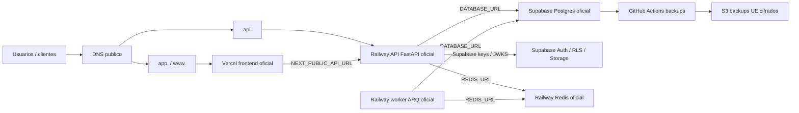
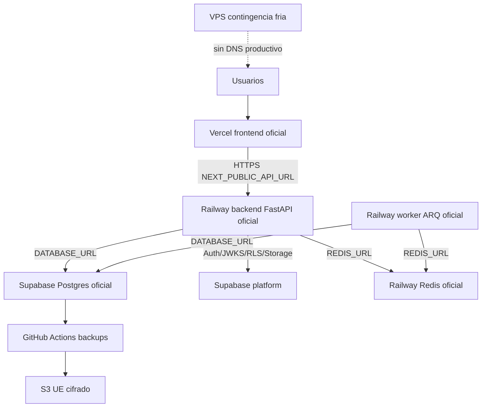

# OPS-001: Topologia productiva oficial

## Objetivo

Reducir dependencia tribal y facilitar auditorias mediante un manual unico de topologia operativa. Este documento consolida servicios, dominios, variables, despliegue, backups y responsables para los despliegues de AB Logistics OS.

Decision canonica cerrada: **produccion oficial = Vercel + Railway + Supabase Postgres + Railway Redis**. El despliegue VPS queda como contingencia fria o laboratorio operativo; no puede operar como produccion simultanea ni recibir trafico publico mientras esta decision siga vigente.

Documentos fuente:

- `docs/INFRASTRUCTURE.md`: Railway, Terraform, servicios y variables IaC.
- `docs/DEPLOYMENT.md`: backend Railway, frontend Vercel, DNS y verificacion.
- `backend/docs/RUNBOOK_VPS.md`: despliegue self-hosted en VPS.
- `docs/operations/ON_CALL_RUNBOOK.md`: guardia, severidades, handoff y checks recurrentes.
- `docs/operations/DISASTER_RECOVERY.md`: restore de base de datos.
- `docs/operations/BACKUP_S3_POLICY.md`: politica BCK-001 de backups S3.
- `docs/operations/GOLIVE_READINESS_CHECKLIST.md`: checklist de go-live (enlaces canonicos y sonda HTTP opcional).
- `docs/operations/HANDOVER_PACKAGE.md`: Fase 3.4 — indice de transferencia a equipo externo.
- `docs/operations/DEPLOY_FINAL_TLS_CHECKLIST.md`: Fase 3.2 — DNS, TLS, CORS, Redis TLS y evidencia de despliegue.
- `docs/operations/MONITORING_OBSERVABILITY.md`: Fase 3.3 — `/health/deep`, Sentry, monitores externos y alertas.

## Decision productiva oficial

| Area | Opcion oficial unica | Opciones no oficiales | Regla operativa |
|------|----------------------|-----------------------|-----------------|
| Frontend web | Vercel | VPS Docker Compose (`frontend` + Caddy/Nginx) | El dominio publico de app apunta solo a Vercel. |
| API FastAPI | Railway (`backend`) | VPS Docker Compose (`backend`) | `api.<dominio>` apunta solo a Railway. |
| Worker asincrono | Railway (`worker`) | Worker en VPS | El worker oficial vive en Railway y comparte Redis con la API. |
| Postgres transaccional | Supabase Postgres | Railway Postgres, self-hosted Postgres | `DATABASE_URL` de produccion apunta solo a Supabase. |
| Redis | Railway Redis | Redis self-hosted u otro proveedor | `REDIS_URL` oficial apunta solo a Railway Redis. |
| Auth / RLS / Storage | Supabase | No aplica | Supabase mantiene Auth, RLS y Storage. |
| Backups | GitHub Actions + S3 UE | `infra/backup_system.sh` legacy | BCK-001 exige region `eu-*` y cifrado SSE. |

Para cambiar cualquiera de estas decisiones hay que abrir una decision operativa nueva, actualizar este OPS-001, rotar variables afectadas y ejecutar smoke completo. Hasta entonces, "Railway o VPS" no es una configuracion productiva valida: Railway es produccion y VPS es contingencia fria.

## Topologia logica

El despliegue VPS no sustituye a la topologia oficial. Si se usa como contingencia fria, debe mantenerse aislado en `docker-compose.prod.yml` (`frontend`, `backend`, `redis`, `caddy`, `cloudflared` opcional y `sentinel-watchdog`) y sin DNS productivo activo.

## Inventario de servicios

| Servicio | Plataforma | Ruta / config | Healthcheck | Responsable |
|----------|------------|---------------|-------------|-------------|
| Frontend Next.js | Vercel | Proyecto Vercel del frontend | Carga HTTPS del dominio publico | Product/Frontend owner |
| API FastAPI | Railway | `backend/railway.json` | `GET /live`, `GET /health`, `GET /ready` si esta disponible | Backend/Platform owner |
| Worker ARQ | Railway | `infra/railway/worker.railway.json` | Logs de jobs y conexion Redis | Backend/Platform owner |
| Redis | Railway | Railway Redis plugin | `redis-cli ping` o healthcheck gestionado | Platform owner |
| Postgres | Supabase | `DATABASE_URL` | Conexion SQL + smoke funcional | Data owner |
| Supabase | Supabase | Dashboard proyecto + migraciones `backend/migrations/` | Auth, RLS y SQL Editor | Data/Security owner |
| Caddy/Nginx | VPS legado/contingencia | `docker-compose.prod.yml`, `infra/caddy/`, `infra/nginx.conf` si aplica | HTTP local + TLS publico | Platform owner |
| Cloudflare Tunnel | VPS legado/contingencia opcional | `CLOUDFLARE_TUNNEL_TOKEN` | Tunnel healthy en Cloudflare | Platform owner |
| Backups DB | GitHub Actions + S3 | `.github/workflows/backup_daily.yml` | Logs `Backup Daily` | Ops/Data owner |
| Restore smoke | GitHub Actions | `.github/workflows/backup_restore_smoke.yml` | Ejecucion semanal/manual verde | Ops/Data owner |
| Guardia operativa | Proceso interno | `docs/operations/ON_CALL_RUNBOOK.md` | Checklist diario/semanal y registro de incidentes | Ops owner |

## Dominios y DNS

| Dominio | Destino | Registro recomendado | Variable relacionada | Responsable |
|---------|---------|----------------------|----------------------|-------------|
| `app.<dominio>` o `www.<dominio>` | Vercel frontend | Segun panel Vercel (`CNAME`, `A`, `ALIAS` o `ANAME`) | `NEXT_PUBLIC_API_URL`, `PUBLIC_APP_URL` | Platform/Frontend owner |
| `api.<dominio>` | Railway backend | `CNAME` al target asignado por Railway | `CORS_ALLOW_ORIGINS`, `ALLOWED_HOSTS`, `API_PUBLIC_HOST` | Platform/Backend owner |
| `api.<dominio>` en VPS contingencia | IP publica del VPS o Cloudflare Tunnel | Prohibido mientras Railway sea produccion oficial | `API_DOMAIN`, `APP_DOMAIN`, `CADDY_BIND`, `CLOUDFLARE_TUNNEL_TOKEN` | Platform owner |
| `security@<dominio>` | Buzon monitorizado | MX/DKIM/SPF en proveedor de correo | `SECURITY_CONTACT_EMAIL` | Security owner |

Regla operativa: tras cualquier cambio DNS, validar HTTPS, actualizar `CORS_ALLOW_ORIGINS` y confirmar que el frontend usa la API oficial de Railway mediante `NEXT_PUBLIC_API_URL`. No debe existir un segundo registro publico apuntando a una API VPS productiva.

## Variables criticas

No copiar secretos reales en este documento. Mantener valores en Railway, Vercel, GitHub Actions, Supabase, Vault o AWS Secrets Manager segun aplique.

### Railway / API / Worker

| Variable | Uso | Notas |
|----------|-----|-------|
| `ENVIRONMENT` | Modo runtime | `production` en produccion. |
| `DATABASE_URL` | Base transaccional | Debe ser Supabase Postgres en produccion oficial. |
| `REDIS_URL` | ARQ, rate limiting, caches | Requerida por API y worker. |
| `SUPABASE_URL` | Proyecto Supabase | Obligatoria. |
| `SUPABASE_KEY`, `SUPABASE_ANON_KEY` | Cliente Supabase | Segun flujo de auth/RLS. |
| `SUPABASE_SERVICE_KEY` | Operaciones servidor/admin | Tratar como secreto critico. |
| `SUPABASE_JWT_SECRET` / `SUPABASE_JWKS_URL` | Validacion JWT | Preferir JWKS si esta configurado. |
| `JWT_SECRET_KEY`, `SESSION_SECRET_KEY` | Tokens propios / sesiones | Secretos fuertes y unicos por entorno. |
| `ENCRYPTION_KEY`, `PII_ENCRYPTION_KEY` | Cifrado app/PII | Rotacion con claves `*_PREVIOUS` si aplica. |
| `SECRET_MANAGER_BACKEND` | Backend de secretos | `env`, `railway`, `vault`, `aws`, `secretsmanager`. |
| `CORS_ALLOW_ORIGINS` | Frontend permitido | Debe incluir dominio publico oficial. |
| `CORS_ALLOW_ORIGIN_REGEX` | Previews Vercel | Usar solo si se aceptan previews. |
| `ALLOWED_HOSTS` | Host header permitido | Debe incluir `api.<dominio>`. |
| `Maps_API_KEY` | Google Maps backend | Geocoding/rutas/matriz. |
| `OPENAI_API_KEY`, `GEMINI_API_KEY`, `ANTHROPIC_API_KEY` | IA/OCR/advisor | Solo si las features estan activas. |
| `SENTRY_DSN`, `APP_RELEASE` | Observabilidad | Release puede venir de SHA Railway y Vercel. |
| `SECURITY_CONTACT_EMAIL` | RFC 9116 | Buzon real y monitorizado antes de go-live. |

### Vercel / Frontend

| Variable | Uso | Notas |
|----------|-----|-------|
| `NEXT_PUBLIC_API_URL` | URL publica de API | Variable principal del frontend. |
| `NEXT_PUBLIC_API_BASE_URL` | Alias retrocompatible | Mantener igual si se usa compatibilidad. |
| `NEXT_PUBLIC_MAPS_API_KEY` / `NEXT_PUBLIC_GOOGLE_MAPS_API_KEY` | Maps browser | Restringir por referrer. |
| `NEXT_PUBLIC_SENTRY_DSN` | Observabilidad frontend | Publica, pero controlada por proyecto. |
| `NEXT_PUBLIC_APP_RELEASE` | Release frontend | Alinear con despliegue si se usa. |
| `NEXT_PUBLIC_SUPPORT_EMAIL` | Contacto UI | Opcional. |
| `NEXT_PUBLIC_SUPABASE_URL`, `NEXT_PUBLIC_SUPABASE_ANON_KEY` | Cliente Supabase frontend | Solo si el frontend llama Supabase directamente. |

### GitHub Actions / Backups

| Variable / secret | Uso | Notas |
|-------------------|-----|-------|
| `SUPABASE_ACCESS_TOKEN` | Export backup Supabase | Secret de GitHub Actions. |
| `SUPABASE_PROJECT_REF` | Proyecto origen backup | Secret de GitHub Actions. |
| `SUPABASE_DB_PASSWORD` | Acceso DB backup | Secret de GitHub Actions. |
| `BACKUP_AWS_ACCESS_KEY_ID`, `BACKUP_AWS_SECRET_ACCESS_KEY` | Upload S3 | Permisos minimos al bucket/prefix. |
| `BACKUP_AWS_REGION` | Region S3 | Obligatorio `eu-*`. |
| `BACKUP_S3_BUCKET`, `BACKUP_S3_PREFIX` | Destino backup | Bucket con bloqueo de acceso publico. |
| `BACKUP_S3_KMS_KEY_ID` | SSE-KMS opcional | Si esta vacio, workflows fuerzan SSE-S3. |
| `RAILWAY_TOKEN` | Terraform Railway | Solo si GitOps/IaC Railway esta activo. |
| `TF_BACKEND_HCL` | Estado remoto Terraform | Obligatorio antes de activar apply en CI. |
| `RAILWAY_TERRAFORM_APPLY_ENABLED` | Control de apply | `true` solo con backend remoto y secretos listos. |

## Checklist de variables por entorno

No promocionar un cambio si falta una casilla obligatoria del entorno afectado.

| Entorno | Vercel frontend | Railway API | Railway worker | Supabase Postgres/Auth | Railway Redis | GitHub Actions |
|---------|-----------------|-------------|----------------|------------------------|---------------|----------------|
| Local | `.env.local` con `NEXT_PUBLIC_API_URL=http://localhost:<puerto>` si aplica. | `.env` local sin secretos productivos. | `.env` local compartiendo Redis local o sandbox. | Proyecto sandbox o fixtures; nunca produccion. | Redis local/sandbox. | No aplica salvo pruebas manuales. |
| Staging | `NEXT_PUBLIC_API_URL` apunta a API staging; dominios preview permitidos solo por regex controlada. | `ENVIRONMENT=staging`, `DATABASE_URL` staging, `CORS_ALLOW_ORIGINS` staging, secretos no productivos. | Mismo `DATABASE_URL` y `REDIS_URL` staging que API. | Supabase staging o schema/proyecto aislado. | Redis staging aislado. | Secrets `TF_VAR_*` staging y backups smoke si se prueban restores. |
| Production | `NEXT_PUBLIC_API_URL=https://api.<dominio>` y `PUBLIC_APP_URL` oficial. | `ENVIRONMENT=production`, `DATABASE_URL` Supabase produccion, `REDIS_URL` Railway Redis produccion, `ALLOWED_HOSTS=api.<dominio>`. | Mismos `DATABASE_URL` y `REDIS_URL` productivos; logs y restart policy activos. | Supabase produccion con RLS, JWKS y service key rotada. | Railway Redis produccion compartido por API/worker. | Backups S3 UE, restore smoke, Terraform con backend remoto. |

Checklist minimo antes de go-live o cambio de proveedor:

- [ ] `NEXT_PUBLIC_API_URL` y `CORS_ALLOW_ORIGINS` apuntan al mismo par frontend/API oficial.
- [ ] `DATABASE_URL` productiva apunta a Supabase y no a Railway/self-hosted.
- [ ] `REDIS_URL` productiva apunta a Railway Redis y es identica en API y worker.
- [ ] `SUPABASE_SERVICE_KEY`, `JWT_SECRET_KEY`, `SESSION_SECRET_KEY` y claves de cifrado existen solo en gestores de secretos del entorno correcto.
- [ ] No hay DNS publico productivo apuntando al VPS.
- [ ] Backups S3 UE y restore smoke usan credenciales del entorno productivo correcto.
- [ ] Variables `NEXT_PUBLIC_*` fueron recompiladas en Vercel tras el ultimo cambio.

## Despliegue

### Railway backend y worker

1. Confirmar que `DATABASE_URL` apunta a Supabase Postgres y que Railway Redis existe.
2. Verificar variables en el entorno correcto de Railway (`production` o `staging`).
3. API: root directory `backend`, config file `/backend/railway.json`, comando `uvicorn app.main:app --host 0.0.0.0 --port $PORT`.
4. Worker: root directory `backend`, config file `/infra/railway/worker.railway.json`, comando `sh scripts/start-worker.sh`.
5. Validar `GET /live`, `GET /health` y logs del worker.

### Vercel frontend

1. Configurar dominios desde Vercel Project Settings.
2. Configurar `NEXT_PUBLIC_API_URL` con `https://api.<dominio>` o URL Railway oficial.
3. Rebuild tras cambios de variables `NEXT_PUBLIC_*`.
4. Validar login, llamada API autenticada y ausencia de errores CORS.

### VPS self-hosted

Uso permitido: contingencia fria, legado o pruebas operativas. No es produccion oficial mientras OPS-001 mantenga Vercel + Railway + Supabase + Railway Redis como decision canonica.

1. Provisionar Ubuntu 24.04 LTS y ejecutar `infra/setup_server.sh` segun `backend/docs/RUNBOOK_VPS.md`.
2. Configurar DNS (`A` al VPS o Cloudflare Tunnel).
3. Crear `.env` desde `production.env.example`.
4. Levantar con `docker compose -f docker-compose.prod.yml --env-file .env up -d --build`.
5. Validar `docker compose -f docker-compose.prod.yml ps`, logs, HTTPS y healthchecks.

Activacion de VPS como contingencia: solo con aprobacion explicita del incident commander, registro de hora de corte, cambio DNS controlado, congelacion de deploys Railway/Vercel y plan de vuelta. Si se activa, deja de ser "produccion simultanea" y pasa a ser una sustitucion temporal documentada.

## Runbook de incidentes segun topologia oficial

Usar este bloque como primera ruta de mitigacion antes de abrir runbooks especificos.

| Incidente | Primer diagnostico | Mitigacion inicial | Escalado |
|-----------|--------------------|--------------------|----------|
| Frontend caido o dominio no resuelve | Revisar deployment Vercel, dominio `app.<dominio>`, certificados y `NEXT_PUBLIC_API_URL`. | Rollback Vercel al ultimo deployment verde; no redirigir a VPS salvo decision P1. | Frontend owner + Platform owner. |
| API Railway no responde | Ejecutar `GET /live`, `GET /health`, revisar logs Railway y ultimo deploy. | Rollback/redeploy del servicio `backend`; validar `ALLOWED_HOSTS` y `CORS_ALLOW_ORIGINS`. | Backend/Platform owner. |
| Worker parado o cola acumulada | Revisar logs del servicio `worker`, conexion `REDIS_URL` y backlog ARQ. | Restart del worker Railway; pausar jobs no criticos si Redis esta degradado. | Backend/Platform owner + Ops. |
| Supabase Postgres degradado | Revisar dashboard Supabase, conexiones, errores SQL y ultimo cambio de migracion. | Congelar despliegues, detener tareas masivas, evaluar restore segun `DISASTER_RECOVERY`. | Data owner + incident commander. |
| Railway Redis degradado | Revisar health del plugin Redis, timeouts API, rate limiting y logs ARQ. | Reducir carga, reiniciar worker, desactivar tareas no criticas que dependan de cola. | Platform owner + Ops. |
| CORS o auth roto tras deploy | Comparar `NEXT_PUBLIC_API_URL`, `CORS_ALLOW_ORIGINS`, `ALLOWED_HOSTS`, JWKS/Supabase keys. | Revertir variables o deployment afectado; recompilar frontend si cambio `NEXT_PUBLIC_*`. | Backend/Frontend owners. |
| Backup diario fallido | Revisar workflow `Backup Daily`, region `BACKUP_AWS_REGION`, permisos S3 y cifrado. | Reejecutar workflow manualmente; si falla dos veces, abrir P2 y validar backup alternativo. | Ops/Data owner. |
| Necesidad de activar VPS | Confirmar P1 real, impacto, duracion estimada y causa no mitigable en Railway/Vercel/Supabase. | Ejecutar plan de corte documentado, cambiar DNS una sola vez y anotar estado de datos. | Incident commander + Platform/Data. |

Reglas de incidente para evitar doble produccion:

- No levantar API VPS con DNS publico mientras Railway siga recibiendo trafico.
- No escribir en dos Postgres a la vez; Supabase es el unico origen canonico.
- No ejecutar dos workers contra la misma cola sin decision explicita de capacidad.
- Todo rollback de variables debe registrar entorno, valor anterior conocido, owner y hora.
- La vuelta desde VPS a la topologia oficial requiere smoke frontend -> API -> Supabase -> Redis -> worker antes de cerrar el incidente.

## Backups y restore

| Control | Implementacion | Evidencia |
|---------|----------------|-----------|
| Backup diario DB | `.github/workflows/backup_daily.yml` | Logs del workflow, objeto S3 cifrado. |
| Residencia UE | `BACKUP_AWS_REGION=eu-*` y validacion bucket | Fallo de workflow si region no cumple. |
| Cifrado | SSE-S3 (`AES256`) o SSE-KMS | `head-object` valida `ServerSideEncryption`. |
| Restore smoke | `.github/workflows/backup_restore_smoke.yml` | Ejecucion semanal o manual con tiempos medidos. |
| Restore manual | `docs/operations/DISASTER_RECOVERY.md` | 5 comandos exactos con `DATABASE_URL`. |
| Script legacy VPS | `infra/backup_system.sh` | Variables `AWS_S3_*`; solo contingencia fria. |

RPO/RTO operativo: documentar en el runbook interno el objetivo contratado con Supabase y comprobarlo contra el ultimo backup restaurable. Railway y VPS no son origen canonico de Postgres en produccion.

## Responsables y handoff

| Rol | Responsabilidad | Backup de rol |
|-----|-----------------|---------------|
| Product/Frontend owner | Vercel, dominio frontend, variables `NEXT_PUBLIC_*`, smoke UI | Platform owner |
| Backend/Platform owner | Railway API/worker, healthchecks, CORS, deploy backend | Security owner |
| Data owner | Supabase/Postgres, migraciones, RLS, restore | Ops owner |
| Security owner | Secretos, rotacion, `SECURITY_CONTACT_EMAIL`, accesos | Backend/Platform owner |
| Ops owner | Backups, DR, GitHub Actions, S3, incidentes | Data owner |

Antes de una auditoria o transferencia de ownership, completar el registro operativo con valores reales fuera del repositorio:

- Proyecto Vercel: URL del dashboard, equipo, owner primario.
- Proyecto Railway: URL del dashboard, entorno oficial, owner primario.
- Proyecto Supabase: project ref, region, owner primario.
- Bucket S3 backups: nombre, region, KMS si aplica, retencion.
- Dominio/DNS: proveedor, owner, TTLs relevantes.
- Canal de incidentes: email/chat/on-call.
- Rotacion de guardia: owner primario, backup, horario cubierto y criterio de escalado.

## Diagrama final aprobado

La linea punteada del VPS representa disponibilidad operativa sin trafico productivo. Activarla implica incidente P1/P2, corte documentado y desactivacion del camino Railway/Vercel afectado para evitar simultaneidad.

## Checklist de auditoria OPS-001

- [ ] Existe un dominio oficial de frontend y esta asociado a Vercel.
- [ ] Existe un dominio oficial de API y resuelve al backend Railway activo.
- [ ] `NEXT_PUBLIC_API_URL` apunta al dominio/API activo.
- [ ] `CORS_ALLOW_ORIGINS` permite solo origenes esperados.
- [ ] API y worker comparten `REDIS_URL` en el mismo entorno.
- [ ] `REDIS_URL` productivo apunta a Railway Redis.
- [ ] `DATABASE_URL` productivo apunta a Supabase Postgres.
- [ ] No hay DNS publico productivo apuntando al VPS.
- [ ] Backups S3 cumplen BCK-001: region UE y cifrado.
- [ ] Restore smoke semanal ejecuta correctamente o existe evidencia manual reciente.
- [ ] Responsables y backups de rol estan asignados.
- [ ] Runbook `ON_CALL_RUNBOOK.md` revisado y rotacion de guardia vigente.
- [ ] Los secretos reales no estan documentados en Git.

## Revision handover (Fase 3.4)

Ultima revision documental u operativa del paquete `HANDOVER_PACKAGE.md`: **(fecha UTC)** — **(nombre)**. Completar tras cada handover o cambio material de topología/owners.
